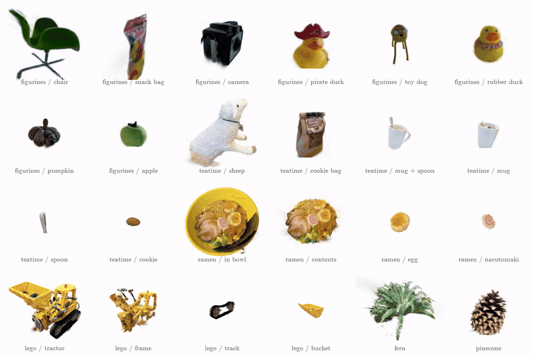
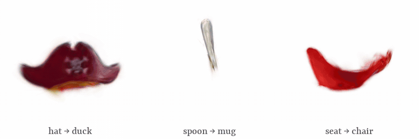

# PePESeg3D: Perception Prior Enhances Multi-Scale Segmentation for 3D Gaussian Splatting

Official PyTorch implementation of **PePESeg3D** (BMVC 2026).

<p align="center"></p>

Objects segmented out of four reconstructed scenes and rendered on their own. Query a point at a
small scale and you get the part; raise the scale and you get the object it belongs to:

<p align="center"></p>

PePESeg3D injects 2D perception priors — SAM masks and monocular depth — into *both* stages of a
multi-scale 3D Gaussian Splatting segmentation pipeline:

- **Stage 1 · PePE Reconstruction** refines Gaussian primitives onto segmentation boundaries and
  regularizes geometry with a monocular-depth prior, giving a semantically aligned backbone.
- **Stage 2 · PePE Contrastive Learning** learns a scale-aware feature field on that frozen geometry,
  using scale-aware mask supervision, depth–color perception cues, and view-consistent centroids.

## Installation

Tested on a single RTX 4090 and RTX 3090 with **Python 3.11, PyTorch 2.6.0, CUDA 11.8**.

```bash
git clone https://github.com/BeCow5X5/PePESeg3D.git
cd PePESeg3D
pip install -r requirements.txt

# CUDA extensions — set the arch list for your GPU
export TORCH_CUDA_ARCH_LIST="8.6;8.9"                              # 3090 / 4090
pip install submodules/simple-knn
pip install submodules/diff-gaussian-rasterization                 # rendering
pip install submodules/diff-gaussian-rasterization-cream           # color + depth  (Stage 1)
pip install submodules/diff-gaussian-rasterization_contrastive_f   # features       (Stage 2)
```

External dependencies:

```bash
# SAM — masks for preprocessing and for promptable evaluation
git clone https://github.com/facebookresearch/segment-anything third_party/segment-anything
pip install -e third_party/segment-anything
mkdir -p third_party/segment-anything/sam_ckpt
wget -P third_party/segment-anything/sam_ckpt \
  https://dl.fbaipublicfiles.com/segment_anything/sam_vit_h_4b8939.pth

# Grounded-SAM — text-prompted masks for the LERF-Mask evaluation
git clone https://github.com/IDEA-Research/Grounded-Segment-Anything
pip install -e Grounded-Segment-Anything/GroundingDINO
cd Grounded-Segment-Anything/GroundingDINO
TORCH_CUDA_ARCH_LIST="8.6;8.9" python setup.py build_ext --inplace && cd ../..

# Depth-Anything-V2 (ViT-B) — monocular depth priors
git clone https://github.com/DepthAnything/Depth-Anything-V2
```

> **Two build gotchas.**
> GroundingDINO's `_C` extension fails *silently* when built for the wrong architecture — no
> detections, empty text masks, zero IoU at every scale. Rebuild it if LERF-Mask scores come out at 0.
> And `render()` expects the stock rasterizer returning `(color, radii)`; if a depth-returning fork of
> `diff_gaussian_rasterization` is installed in the same environment it will shadow this one, so keep
> `submodules/diff-gaussian-rasterization` first on `PYTHONPATH`.

## Data

We evaluate on **LERF-Mask** and **LERF-Mask-Fine**. Expected layout (`DATA_ROOT` defaults to `../data`):

```
<DATA_ROOT>/lerf_mask/<scene>/
├── images/               # input views
├── images_train/         # training split
├── test_mask/            # <view_idx>/<prompt>.png annotations
├── sparse/               # COLMAP reconstruction
├── depth/                # Depth-Anything-V2 relative depth, 8-bit PNG
├── sam_masks/            # SAM "segment everything" masks, [N, H, W] bool
├── single_dense_maps/    # SAM masks flattened to one [H, W] int16 ID map
└── mask_scales/          # physical 3D scale per mask
```

Run Depth-Anything-V2 (ViT-B) into `<scene>/depth`, then generate the mask priors:

```bash
bash scripts/preprocess.sh lerf_mask figurines ramen teatime
```

This writes `sam_masks/`, `single_dense_maps/`, and `mask_scales/`. In `single_dense_maps/`, each
view's SAM masks are painted largest-first into one ID map, so every pixel carries the *smallest*
mask covering it — the finest granularity that view offers.

## Training

```bash
# Stage 1 — PePE Reconstruction (30k iterations)
DEPTH_FROM=4000 DECOMPOSE_FROM=3000 EXTRA_ARGS="--train_split --eval" \
  bash scripts/train_stage1_recon.sh lerf_mask figurines ramen teatime

# Stage 2 — PePE Contrastive Learning (10k iterations, frozen geometry)
EXTRA_ARGS="--train_split" \
  bash scripts/train_stage2_seg.sh lerf_mask figurines ramen teatime
```

Both scripts read `scripts/common.sh`; override `DATA_ROOT`, `OUTPUT_ROOT`, or `GPUS` from the
environment (`GPUS="0 1 2 3"` trains four scenes in parallel).

Defaults follow the paper: 32-dim features, Adam lr 2.5e-3, 1000 sampled pixels per step,
`λ_p = 0.2`, `λ_c^U = 0.3`, `λ_c^L = 0.1`, centroid warm-up at iteration 7000, centroid refresh every
200 steps. They live in `arguments/__init__.py` and at the top of `train_pepe_contrastive.py`.

<details>
<summary>Ablations</summary>

Stage 2 (Table 7) — flags on `scripts/train_stage2_seg.sh`:

| Row | `EXTRA_ARGS` |
|---|---|
| Baseline | [SAGA](https://github.com/Jumpat/SegAnyGAussians), official implementation |
| + PePE Reconstruction | `--ablate_perception_loss --ablate_consistency_loss` |
| + Perception loss | `--ablate_consistency_loss` |
| + Consistency (full) | none |

Stage 1 (Table 6) — push `DECOMPOSE_FROM` past `--iterations` to disable Gaussian refinement, and
`DEPTH_FROM` past it to disable the monocular-depth term.

</details>

## Pretrained models

| Scene | Checkpoint | Size |
|---|---|---|
| figurines | [figurines_pepe.tar.gz](https://github.com/BeCow5X5/PePESeg3D/releases/download/v1.0/figurines_pepe.tar.gz) | 610 MB |
| ramen | [ramen_pepe.tar.gz](https://github.com/BeCow5X5/PePESeg3D/releases/download/v1.0/ramen_pepe.tar.gz) | 320 MB |
| teatime | [teatime_pepe.tar.gz](https://github.com/BeCow5X5/PePESeg3D/releases/download/v1.0/teatime_pepe.tar.gz) | 702 MB |

```bash
mkdir -p output/lerf_mask_pepe
for scene in figurines ramen teatime; do
  wget https://github.com/BeCow5X5/PePESeg3D/releases/download/v1.0/${scene}_pepe.tar.gz
  tar -xzf ${scene}_pepe.tar.gz -C output/lerf_mask_pepe
done
```

Each archive holds the Stage-1 geometry (`iteration_30000`), the Stage-2 feature field and scale gate
(`iteration_10000`), and `cfg_args`. `cfg_args` records absolute paths from our machine, so always
pass `-s` — the evaluation scripts already do.

## Evaluation

```bash
bash scripts/eval_lerf_mask.sh figurines ramen teatime               # Table 2
GRANULARITY=fine bash scripts/eval_lerf_mask.sh figurines ramen teatime   # Table 3
```

| Scene | mIoU | mBIoU |
|---|---|---|
| figurines | 88.3 | 85.9 |
| ramen | 74.9 | 68.2 |
| teatime | 78.3 | 75.4 |
| **mean** | **80.5** | **76.5** |

Qualitative multi-scale segmentation of a whole scene, with no text prompt — renders scales
0.0 / 0.5 / 1.0 for every training view:

```bash
python full_segmentation.py --source_path output/lerf_mask_pepe/figurines_pepe \
                            --output_path segmentation_samples/figurines
```

Reconstruction quality:

```bash
python render.py -m <model_path> -s <scene_path> --skip_train --eval --train_split
python metrics.py -m <model_path>
```

> Do not pass `--iteration` to the LERF-Mask scripts. Stage-1 (30k) and Stage-2 (10k) checkpoints are
> resolved separately and a single value cannot address both.

## Acknowledgements

Built on [3D Gaussian Splatting](https://github.com/graphdeco-inria/gaussian-splatting),
[SAGA](https://github.com/Jumpat/SegAnyGAussians), [SAM](https://github.com/facebookresearch/segment-anything),
[Depth-Anything-V2](https://github.com/DepthAnything/Depth-Anything-V2), and
[GroundingDINO](https://github.com/IDEA-Research/GroundingDINO).

The rasterizers under `submodules/` are forks of the 3DGS rasterizer and inherit its license;
`diff-gaussian-rasterization_contrastive_f` follows SAGA. See `LICENSE` for this repository.

This research was supported by Basic Science Research Program through the National Research Foundation of Korea(NRF) funded by the Ministry of Education(RS-2025-25404201).
This work was supported by the National Research Foundation of Korea(NRF) grant funded by the Korea government(MSIT) (RS-2026-25470670).
